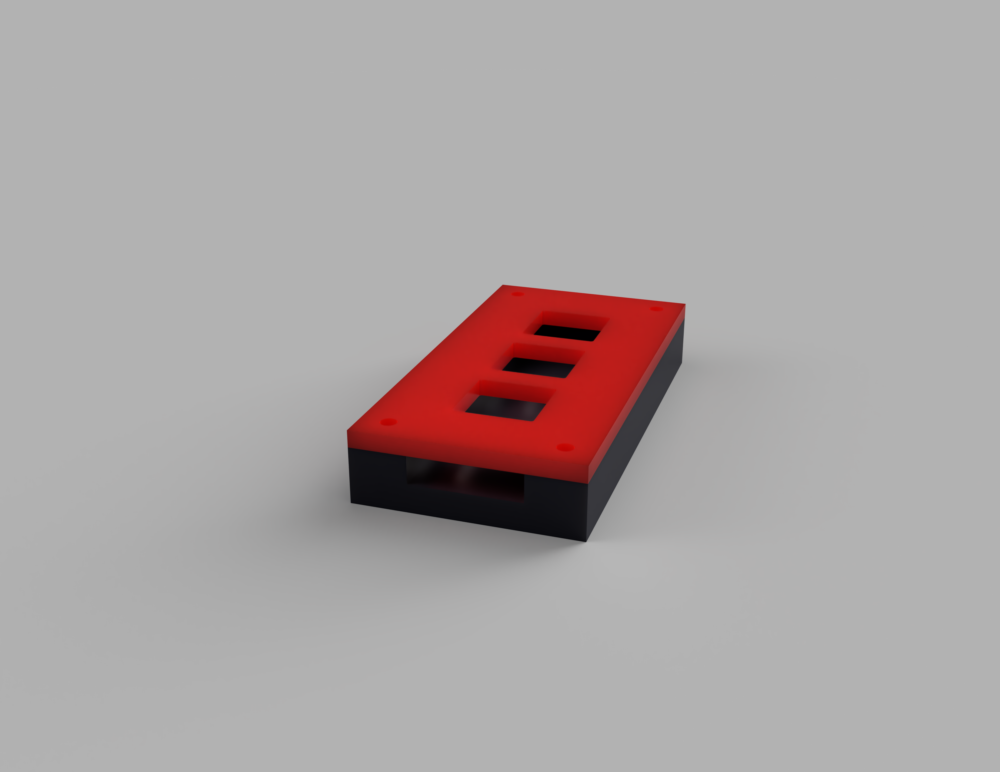
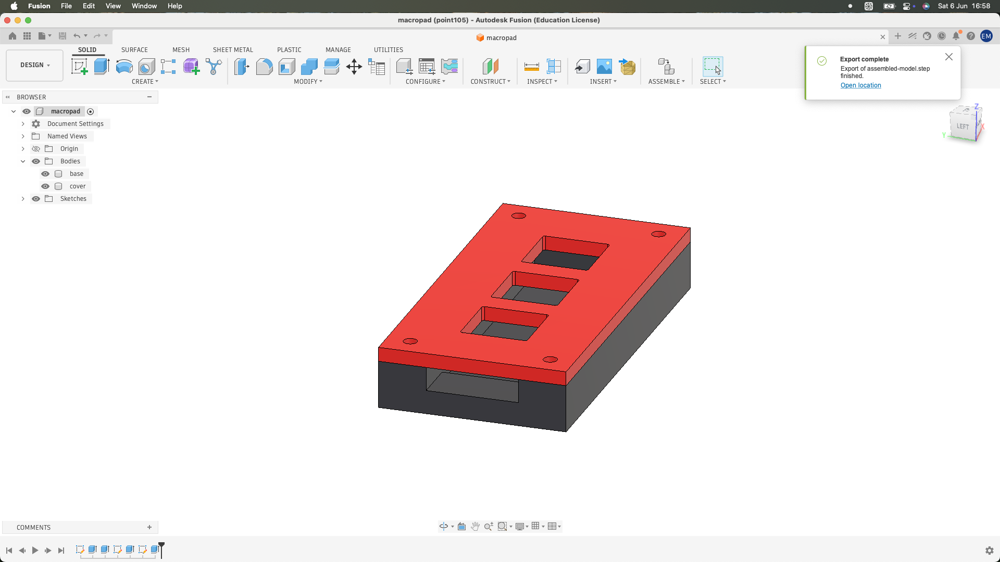
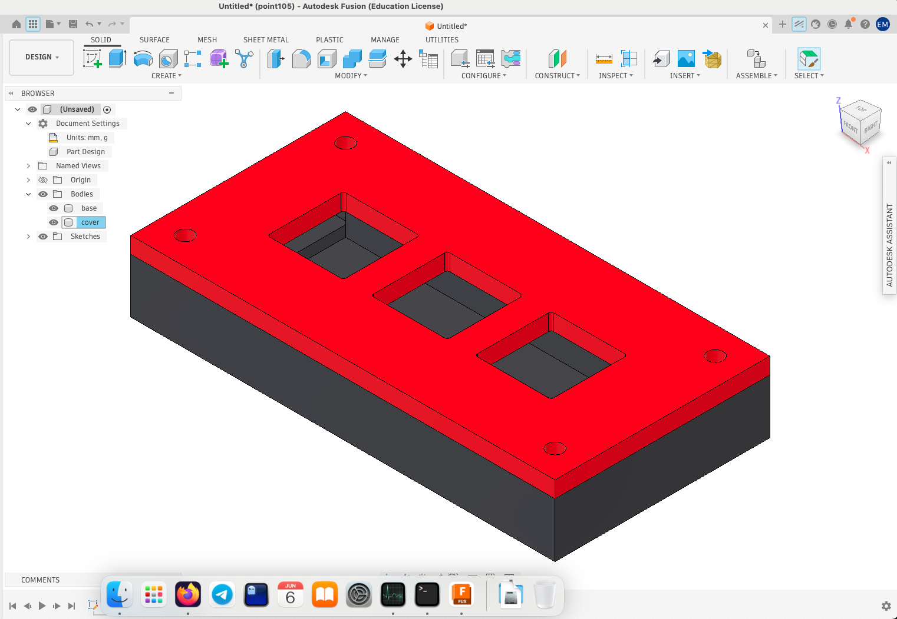
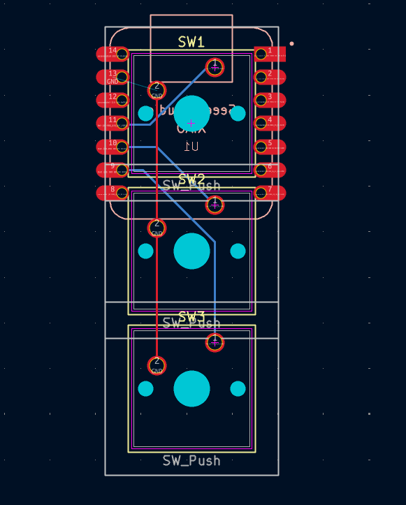

# 3-Key Macropad Submission

This repository contains the design files and documentation for my 3-key programmable macropad.

## Screenshots

### Assembled Render

### Schematic

### PCB Layout

### 3D Case Design

## Bill of Materials (BOM)

| Component | Description | Quantity |
|-----------|-------------|----------|
| Seeed Studio XIAO RP2040 | Dual-core ARM Cortex M0+ Microcontroller | 1 |
| Cherry MX Blue Switches | Mechanical switches (or compatible) | 3 |
| Custom PCB | 2-layer PCB designed in KiCad | 1 |
| 3D Printed Case (Top) | PLA/PETG Enclosure | 1 |
| 3D Printed Case (Bottom) | PLA/PETG Base | 1 |
| M3 Heatset Inserts | 4.7mm diameter holes | 4 |
| M3 Screws | 6mm length | 4 |

## Project Structure

- `CAD/`: STEP file of the assembled model.
- `PCB/`: KiCad project files (schematic, PCB layout).
- `Firmware/`: (Pending) Firmware source code.
- `production/`: Exported Gerbers and STEP files for case parts.

---
Designed with ❤️ by [Elnur](https://github.com/ElnurMavlonov)

*Note: This README was generated with the assistance of AI.*
